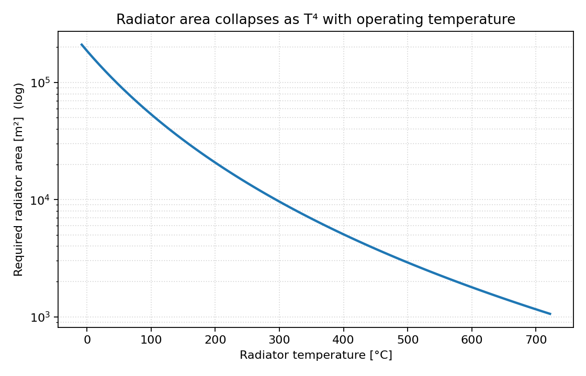
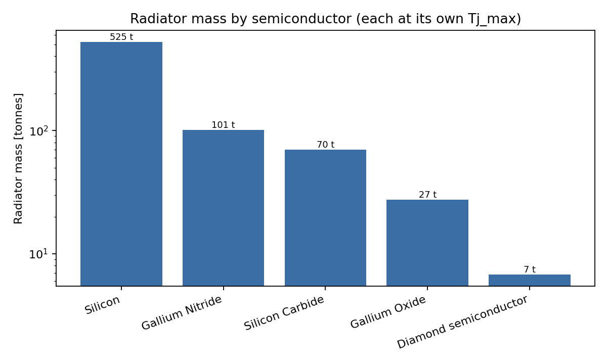
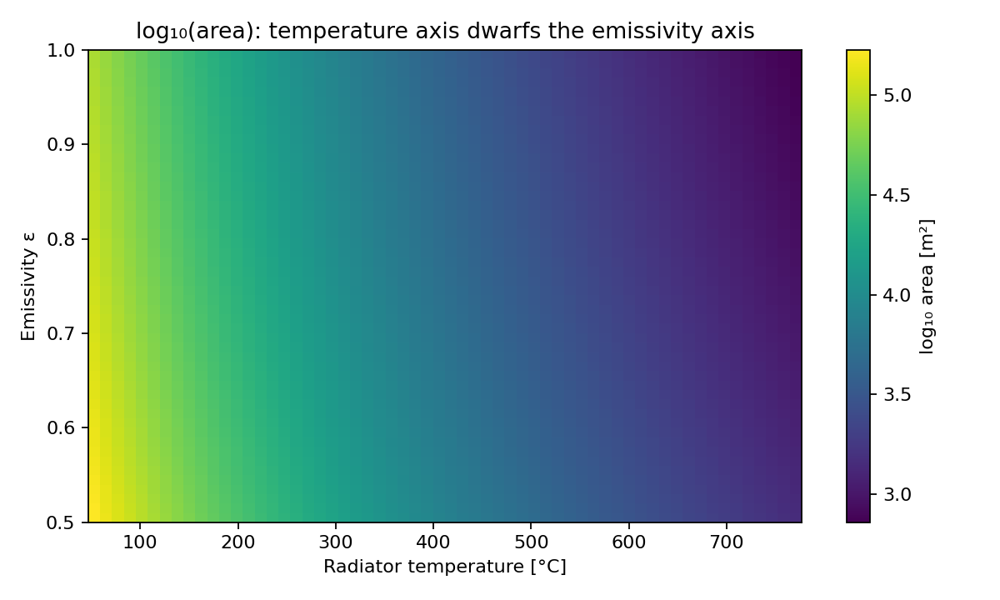
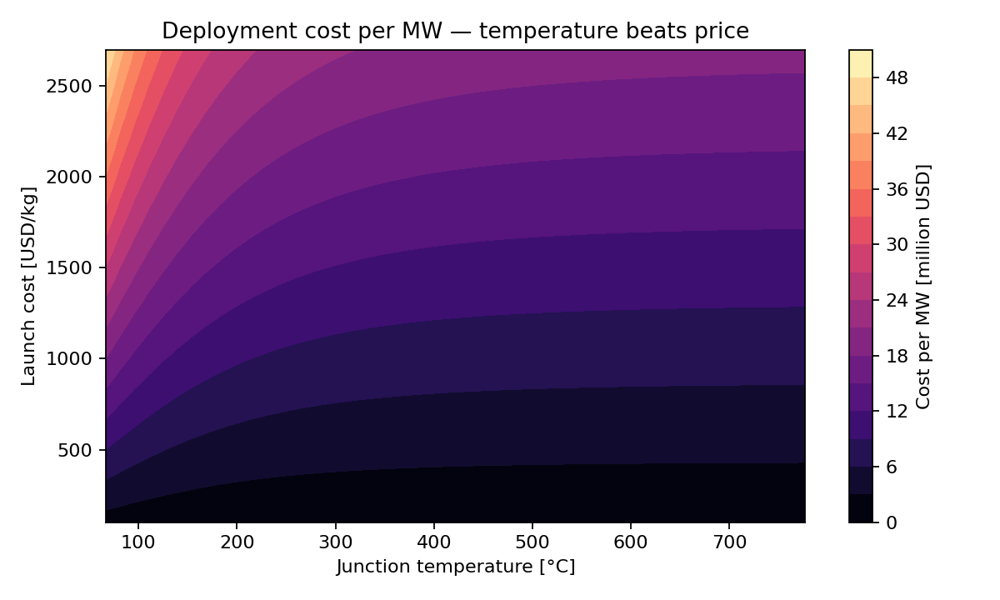
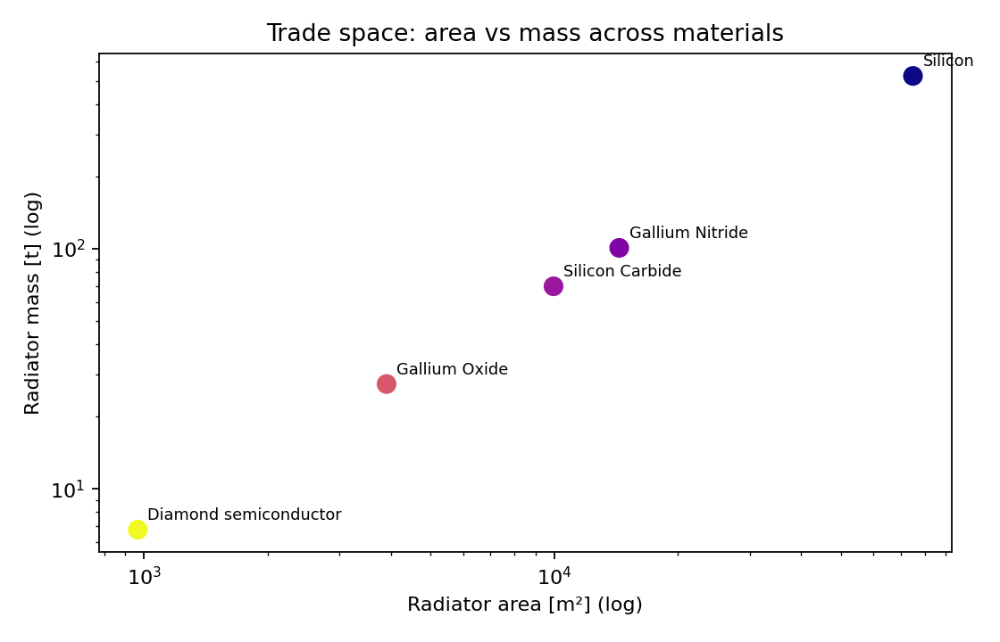

# Research Outputs (auto-generated)

> Regenerate with `python generate_research_outputs.py`. All numbers below come directly from the simulation code.

Heat load modelled: **100 MW** (from 100 MW compute × heat fraction 1.0).

## Material comparison (each at its own maximum junction temperature)

| Material                   |   Max Tj [C] |   Radiator T [K] |   Radiator area [m2] |   Radiator mass [kg] |   Mass vs silicon |   TRL |
|:---------------------------|-------------:|-----------------:|---------------------:|---------------------:|------------------:|------:|
| Silicon (Si)               |       124.85 |              343 |               74,948 |              524,639 |             1     |     9 |
| Gallium Nitride (GaN)      |       299.85 |              518 |               14,409 |              100,860 |             0.192 |     7 |
| Silicon Carbide (4H-SiC)   |       349.85 |              568 |                9,967 |               69,766 |             0.133 |     8 |
| Gallium Oxide (beta-Ga2O3) |       499.85 |              718 |                3,903 |               27,324 |             0.052 |     4 |
| Diamond semiconductor      |       799.85 |             1018 |                  966 |                6,762 |             0.013 |     3 |

## 1. Executive Summary

Rejecting 100 MW in vacuum is feasible only if radiator mass is controlled, and the controlling variable is semiconductor operating temperature. A silicon design needs roughly 74,948 m² and 525 t of radiator. A diamond-class design needs about 966 m² and 6.8 t — a **78× reduction**. Radiator-technology levers (droplet, sheet, metamaterial) help linearly and are bounded; temperature is a fourth-power lever and dominates.

## 2. Technical Findings

- Radiator area ∝ 1/(T⁴ − T_sink⁴): temperature is a fourth-power lever.
- Emissivity is linear and bounded to ≤2× (ε from 0.5 to 1.0).
- Silicon → diamond: **78×** radiator area and mass reduction; diamond ≈ 1.3% of silicon mass.
- Droplet and liquid-sheet radiators give large areal-density savings with negligible coolant loss, but act on the linear lever.
- GEO absorbs ~5.5 W/m² vs ~208 W/m² in LEO: GEO is the kindest sink.
- Coolant pumping is a minor penalty (~1–7%); coolant choice mainly gates high-temperature operation (lithium, molten salt).

## 3. Limiting Factors

- Maturity: diamond (TRL 3) and Ga₂O₃ (TRL 4) are not deployable now; SiC (TRL 8) is the realistic near-term lever.
- Leakage and Arrhenius reliability rise with temperature; the optimal Tj may sit below the material ceiling.
- Peripheral electronics may not tolerate die-level temperatures.
- Large radiators raise structural, attitude-control and debris-survival challenges not modelled here.
- Power generation/storage mass and eclipse cycling are only coarsely captured.

## 4. Design Recommendations

1. Treat maximum junction temperature as a first-class design variable.
2. Use SiC for the first generation (~7× radiator saving at TRL 8).
3. Fund diamond and Ga₂O₃ maturation as the highest-leverage investment.
4. Pair high-temperature loops with lithium/molten-salt coolants and droplet/sheet radiators to compound savings.
5. Prefer GEO where latency permits for the gentlest thermal environment.

## 5. Future Research Areas

- A combined objective folding leakage and reliability into a mass-optimal junction temperature expressed in $/MW.
- Two-phase coolant loops and nodal/FEM radiator models.
- Beta-angle-resolved fluxes and eclipse-transient sizing.
- Micrometeoroid/debris survivability of droplet and sheet radiators.
- Bottom-up cost-estimating relationships and lifecycle cost.

## Figures

